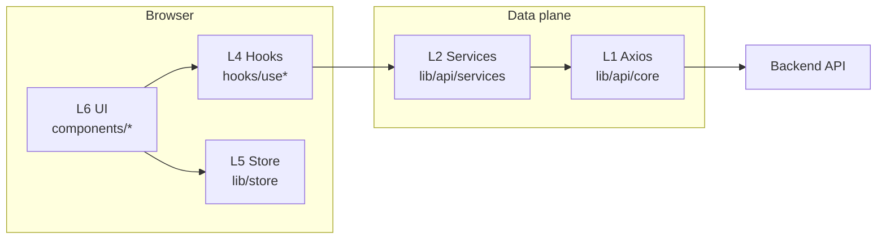
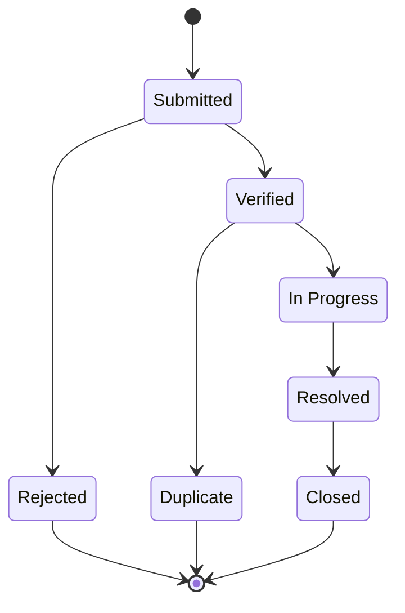

# GreenLens Portal

### SU26SE049 · Environmental pollution crowdsourcing · Web client

Role-based intake, verification, field execution, and administration — aligned with **Business Rules v1.0**.

**Version** `0.1.0` · **Package** [`greenlens-portal`](package.json)

[Overview](#at-a-glance) · [Stack](#technology-matrix) · [Architecture](#system-architecture) · [Run locally](#local-development)

> **Note on “animation” in README:** GitHub renders this file as **static** Markdown (no embedded CSS/JS). **Shields.io badges** above load live when the page opens; **Mermaid** diagrams render as graphics. For motion and transitions, use the **running app** (`npm run dev`) or your deployed preview.

---

## At a glance

| Dimension           | Detail                                                                                                            |
| ------------------- | ----------------------------------------------------------------------------------------------------------------- |
| **Program**         | Capstone **SU26SE049** — crowdsourced reporting of environmental pollution                                        |
| **Repository role** | **Web frontend** (Next.js App Router); backend and mobile are separate deliverables                               |
| **Governance**      | **BR v1.0** drives validation copy, statuses, and role capabilities (see [BR index](#business-rules-index) below) |
| **Quality bar**     | ESLint + Prettier, Husky + lint-staged, Commitlint (gitmoji + conventional **type**), CI: lint / `tsc` / `build`  |
| **Confidentiality** | `private` package; do not commit `.env*` or secrets ([`.gitignore`](.gitignore))                                  |

### Non-functional targets (product brief)

| Target          | Objective                                                                                       |
| --------------- | ----------------------------------------------------------------------------------------------- |
| **Concurrency** | Support on the order of **5,000** simultaneous users (platform NFR)                             |
| **Data volume** | Designed toward **100,000+** reports at scale (platform NFR)                                    |
| **Experience**  | **Mobile-first** UI; performance gate **BR-SYS-001** (e.g. page budget on 4G, API p95)          |
| **Security**    | HTTPS, Zod on forms, single HTTP client with centralized **401** handling — see **`CLAUDE.md`** |

---

## Personas & product scope

| Persona                   | Primary outcomes                                          | BR families (typical)          |
| ------------------------- | --------------------------------------------------------- | ------------------------------ |
| **Citizen**               | Submit/track reports, map discovery, profile & engagement | BR-REP, BR-MAP, BR-GAM, BR-NTF |
| **Environmental officer** | Queue, verify, prioritize, assign cleanup                 | BR-OFF, BR-REP, BR-AI          |
| **Cleanup team**          | Tasks, check-in, evidence, escalation                     | BR-CLN                         |
| **Administrator**         | Users, categories, templates, spam, audit                 | BR-ADM                         |

| In scope (this repo)                              | Out of scope                  |
| ------------------------------------------------- | ----------------------------- |
| Next.js UI, hooks, services, middleware UX guards | Backend API implementation    |
| Client validation & error messages per BR         | Database / infra provisioning |
| GitHub Actions CI for this package                | Native mobile app codebase    |

---

## Technology matrix

| Layer            | Technology                                               | Role                                                           |
| ---------------- | -------------------------------------------------------- | -------------------------------------------------------------- |
| **Runtime**      | Node.js **22.x**                                         | Matches [`.github/workflows/ci.yml`](.github/workflows/ci.yml) |
| **Application**  | **Next.js** 16 (App Router, RSC)                         | Routing, SSR/RSC, `next/image`, deployment unit                |
| **UI**           | **React** 19, **shadcn/ui**, **Radix**                   | Accessible components, design system                           |
| **Styling**      | **Tailwind CSS v4** (`@theme`, CSS-first)                | Tokens, layout, dark variant                                   |
| **Forms**        | **React Hook Form** + **Zod** + resolvers                | Typed forms; messages aligned with BR where implemented        |
| **Server state** | **TanStack Query**                                       | Queries/mutations, stable query keys                           |
| **Transport**    | **Axios** via `lib/api/core.ts`                          | One client: base URL, headers, interceptors                    |
| **Client state** | **Zustand**                                              | Auth shell, UI — **not** a duplicate of React Query cache      |
| **Tooling**      | TypeScript (strict), ESLint, Prettier, Husky, Commitlint | Enforce consistency before push                                |

### Key dependencies (pinned in `package.json`)

| Concern             | Packages                                             |
| ------------------- | ---------------------------------------------------- |
| HTTP & auth helpers | `axios`, `jose`                                      |
| UX feedback         | `sonner`, `lucide-react`                             |
| Class names         | `clsx`, `tailwind-merge`, `class-variance-authority` |

---

## System architecture

### Layer model (L1–L6)

| Layer  | Name                   | Location (convention)        | Rule of thumb                       |
| :----: | ---------------------- | ---------------------------- | ----------------------------------- |
| **L1** | HTTP singleton         | `lib/api/core.ts`            | No direct use from components       |
| **L2** | Domain services + DTOs | `lib/api/services/fetch*.ts` | Typed calls; no `any` on responses  |
| **L3** | RSC / Server Actions   | `app/**`                     | SEO, TTFB, server-first data        |
| **L4** | React Query hooks      | `hooks/use*.ts`              | `queryKey` factories; call L2 only  |
| **L5** | Zustand                | `lib/store/*`                | Auth/UI slices — not bulk API cache |
| **L6** | Presentation           | `components/**`              | Islands; no raw `axios` in UI       |

### Report lifecycle (core BR-REP-020)

> UI must gate actions by **role** and current status; see **BR-REP-020 / BR-REP-021** in `CLAUDE.md`.

---

## Route groups (App Router)

| Persona | Route group (example) | URL prefix (example)                |
| ------- | --------------------- | ----------------------------------- |
| Citizen | `(citizen)/`          | `/`, `/map`, `/reports`, `/profile` |
| Officer | `(officer)/`          | `/officer/...`                      |
| Cleanup | `(cleanup)/`          | `/cleanup/...`                      |
| Admin   | `(admin)/`            | `/admin/...`                        |
| Auth    | `(auth)/`             | `/login`, `/register`, …            |

Middleware enforces **UX-level** guards; **authoritative authorization** remains on the API.

---

<strong>Business rules index</strong> — click to expand

| Prefix                  | Topic                                                              |
| ----------------------- | ------------------------------------------------------------------ |
| **BR-AUTH**             | Registration, login, OTP, session, CAPTCHA (e.g. from 3rd failure) |
| **BR-REP**              | Reports, drafts, media, duplicate, lifecycle                       |
| **BR-MAP**              | Map, nearby, privacy, refresh policy                               |
| **BR-OFF**              | Officer queue, SLA, assignment, export                             |
| **BR-CLN**              | Cleanup tasks, check-in radius, evidence                           |
| **BR-NTF** / **BR-CMT** | Notifications, comments                                            |
| **BR-GAM**              | Gamification                                                       |
| **BR-AI**               | AI hints — officer decides                                         |
| **BR-ADM**              | Administration                                                     |
| **BR-DAT** / **BR-SYS** | Data handling, performance                                         |

Full FE mapping: **`CLAUDE.md` §10**.

---

## Prerequisites

| Requirement | Version / notes                                             |
| ----------- | ----------------------------------------------------------- |
| **Node.js** | **22.x**                                                    |
| **npm**     | **10+** recommended; use `npm ci` for reproducible installs |

---

## Local development

| Step           | Command / action                                                        |
| -------------- | ----------------------------------------------------------------------- |
| 1. Clone       | `git clone <repository-url>` && `cd greenlens-portal`                   |
| 2. Install     | `npm ci`                                                                |
| 3. Environment | Copy `.env.example` → `.env.local` when available; never commit secrets |
| 4. Dev server  | `npm run dev` → [http://localhost:3000](http://localhost:3000)          |

---

## Environment

<strong>Typical variables</strong> (confirm in <code>CLAUDE.md</code> / backend contract)

| Variable                         | Visibility | Purpose                              |
| -------------------------------- | ---------- | ------------------------------------ |
| `NEXT_PUBLIC_APP_NAME`           | Public     | App label                            |
| `NEXT_PUBLIC_APP_URL`            | Public     | Canonical site URL                   |
| `NEXT_PUBLIC_API_BASE_URL`       | Public     | REST API origin for L1               |
| `NEXT_PUBLIC_MAP_DEFAULT_CENTER` | Public     | Default map center (e.g. VN metro)   |
| `NEXT_PUBLIC_CDN_BASE_URL`       | Public     | Media CDN for `next/image` allowlist |

Server-only secrets belong in **non-**`NEXT_PUBLIC_` names and Route Handlers only.

---

## npm scripts

| Script          | Description             |
| --------------- | ----------------------- |
| `npm run dev`   | Development server      |
| `npm run build` | Production build        |
| `npm run start` | Serve production bundle |
| `npm run lint`  | ESLint                  |

| CI step (GitHub Actions) | Command                                                         |
| ------------------------ | --------------------------------------------------------------- |
| Install                  | `npm ci`                                                        |
| Lint                     | `npm run lint`                                                  |
| Typecheck                | `npx tsc --noEmit`                                              |
| Build                    | `npm run build` (with public env from secrets or safe defaults) |

---

## Documentation map

| Document        | Contents                                                                  |
| --------------- | ------------------------------------------------------------------------- |
| **`CLAUDE.md`** | Stack, directory tree, L1–L6, BR index, performance & security checklists |
| **`docs/`**     | Plans, deep dives, sprint notes                                           |
| **`AGENTS.md`** | Multi-agent conventions for AI-assisted development                       |

---

## Engineering standards

| Area               | Standard                                                                                                      |
| ------------------ | ------------------------------------------------------------------------------------------------------------- |
| **Commits**        | Conventional **type** + subject; gitmoji optional **before** type, e.g. `:sparkles: feat: add report filters` |
| **Pre-commit**     | Husky → **lint-staged** (staged files only)                                                                   |
| **Commit message** | Husky → **commitlint** (`commitlint-config-gitmoji`)                                                          |
| **Pull requests**  | `npm run lint` and `npm run build` pass locally; small, reviewable diffs                                      |

| Commit type | When to use                         |
| ----------- | ----------------------------------- |
| `feat`      | New user-facing capability          |
| `fix`       | Bug fix                             |
| `chore`     | Tooling, config, housekeeping       |
| `docs`      | Documentation only                  |
| `refactor`  | Code change without behavior change |
| `test`      | Tests (when introduced)             |

---

## License

Private project — see **`package.json`** (`"private": true`). Use is limited to the course or team agreement unless otherwise specified.
